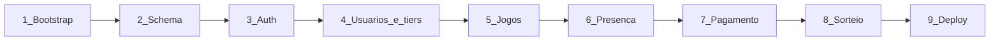
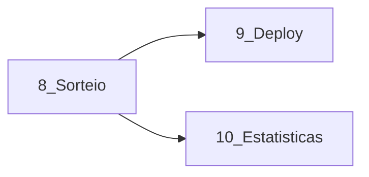

# GARUX — Roadmap

Caminho até o MVP. Regras de produto em [doc.md](../doc.md). Stack e banco em [stack.md](../stack.md).

Cada fase tem pasta própria com o que implementar e o que testar.

## MVP

O MVP fecha quando Admin e Membro completam o fluxo do spec:

- Login com usuário e senha; sem cadastro público
- Admin cria usuários, define data/horário/local, cancela a semana, altera tiers, marca pagamento e sorteia times
- Membro vê a home (data + calendário + lista de pagamento), confirma presença, vê membros/pagamentos e recebe o modal de cobrança
- Sorteio persistido: dois times, balanceado por tier, no máximo um Capitão por time; ímpar vira reserva do sorteio

## Ordem de implementação

As fases seguem dependência: não adiantar tela de sorteio sem presença e tiers, nem pagamento sem jogo.

| Fase | Feature | Depende de | Status |
| --- | --- | --- | --- |
| 1 | [Bootstrap](01-bootstrap/README.md) | — | pronto |
| 2 | [Schema e migrations](02-schema/README.md) | 1 | pronto |
| 3 | [Auth e papéis](03-auth/README.md) | 2 | pronto |
| 4 | [Usuários e tiers](04-usuarios-e-tiers/README.md) | 3 | pronto |
| 5 | [Jogos e home](05-jogos-e-home/README.md) | 4 | pronto |
| 6 | [Presença e membros](06-presenca-e-membros/README.md) | 5 | pronto |
| 7 | [Pagamento e modal](07-pagamento-e-modal/README.md) | 6 | pronto |
| 8 | [Sorteio](08-sorteio/README.md) | 6 e 7 | pronto |
| 9 | [Deploy](09-deploy/README.md) | 8 | pendente |

Fase 8 depende de presença (quem entra no sorteio) e de tiers (balanceamento). Pagamento pode estar pronto em paralelo depois da 6, mas o modal usa o mesmo “próximo fut”.

## Pós-MVP

Features depois do deploy; não bloqueiam o fechamento das fases 1–9.

| Fase | Feature | Depende de | Status |
| --- | --- | --- | --- |
| 10 | [Estatísticas do jogo](10-estatisticas-jogo/README.md) | 5 e 6 (confirmados do próximo fut) | pendente |

## Fora do MVP

Não entra nesta versão (e não está na fase 10):

- Recuperação de senha por e-mail
- OAuth / login social
- Cadastro público
- Histórico financeiro além da flag do próximo fut
- Notificações externas (e-mail, WhatsApp, push)
- Terceiro time no sorteio
- Ranking avançado / gráficos além do escopo da fase 10
